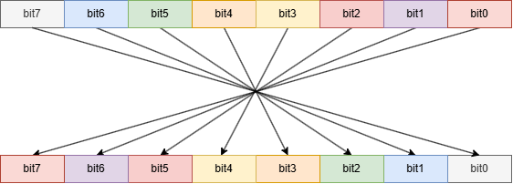

# NIDB (Nova Intel Decode Bin)
Parse Intel rpd file to bin


## 工作原理

NIDB工具的核心功能是在Intel FPGA的RPD文件格式和二进制BIN文件之间进行转换：

根据Intel官方描述：https://www.intel.com/content/www/us/en/docs/programmable/683710/current/programming-and-configuration-file-support.html

## 如何编译

```bash
cmake -B ./build
cmake --build ./build
```

## 如何使用

```bash
# RPD转换为BIN文件
nidb -r2b input.rpd -o output.bin

# BIN转换为RPD文件
nidb -b2r input.bin -o output.rpd

# 显示帮助信息
nidb --help
```

## 注意事项

在使用NIDB工具时，请确保：

- 输入文件格式正确
- 具有足够的磁盘空间
- 对目标目录有写入权限

## 贡献指南

欢迎提交Pull Request来改进NIDB工具。请确保：

- 代码符合项目的编码规范
- 添加适当的测试用例
- 更新相关文档

## 许可证

本项目采用MIT许可证。详见LICENSE文件。